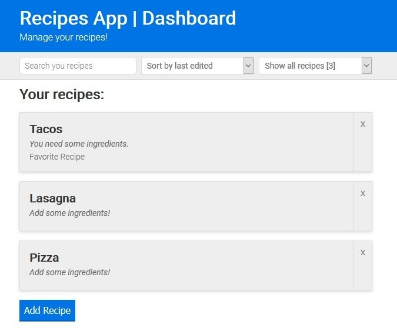
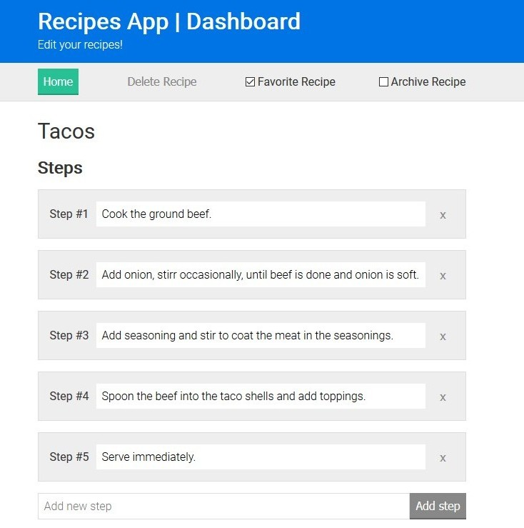
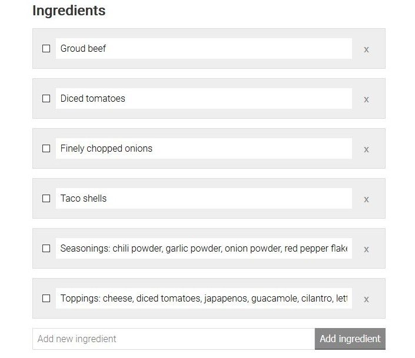

<h1 align="center">Recipio</h1>
<p align="center">
  <a href="https://recipes-app.netlify.com/">
    
  </a>
</p>

<p align="center">
  Manage your recipes!
</p>

## Table of Contents
* [Demo](#demo)
* [Features](#features)
* [Usage Example](#usage-example)
* [Quick Guide](#quick-guide)
* [Built With](#built-with)
* [Contributing](#contributing)
* [Authors](#authors)
* [License](#license)

---

## Demo
Here is a working live demo: [**https://recipes-app.netlify.com/**](https://recipes-app.netlify.com/)


## Features
* Add recipe steps.
* Manage ingredients.
* Fav and archive recipes.


## Usage example




---

## Quick Guide

To clone and run this application, you'll need [Git](https://git-scm.com) and [Node.js](https://nodejs.org/en/download/) (which comes with [npm](http://npmjs.com)) installed on your computer. From your command line:
1. Clone this repository
```sh
git clone https://github.com/guidosantillan01/recipio
```
2. Go into the repository
```sh
cd recipio
```
3. Install dependencies
```sh
npm install
```
4. Run the app, you will then be able to access it at `localhost:3000`
```sh
npm start
```

> Note: If you're using Linux Bash for Windows, [see this guide](https://www.howtogeek.com/261575/how-to-run-graphical-linux-desktop-applications-from-windows-10s-bash-shell/) or use `node` from the command prompt.


---


## Built with
This project uses a number of open source projects to work properly:

* Pure Javascript
* Webpack 4.5.0
* MomentJS
* uuidv4


---

## Contributing

If you'd like to contribute, please fork the repository and use a feature branch. Pull requests are warmly welcome.


## Authors
* Guido Santillan Arias - [guidosantillan01@gmail.com](guidosantillan01@gmail.com) - [www.guidosantillan.com](www.guidosantillan.com)


## Licence
This project is licensed under the **MIT license** - see the [LICENSE](./LICENSE.txt) file for details.
